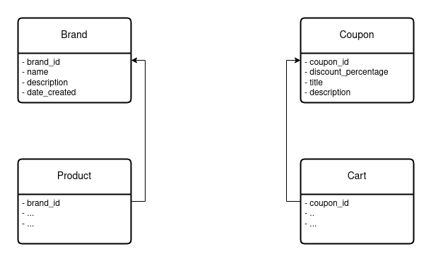

# Var 4 of E-Commerce App: Brand and Coupon
Aplikasi webshop dengan fitur katalog standar ditambah
dengan, keranjang, checkout, pembayaran standar, filter by
brand dan kupon.

## Entity Relationship Diagram for Added Feature

## Added Endpoint
Endpoint baru yang ditambahkan pada variasi ini
### Brand
Filter products by brand:
- GET api/public/products/{brand_name}

Retrieve all brands
- GET api/public/brands
        
Create new brand
- POST api/admin/brand

Edit brand
- PUT api/admin/{brand_id}

Delete brand
- DELETE api/admin/{brand_id}

### Coupon
Retrieve all coupons
- GET api/public/coupons

Add coupon to user's cart 
- POST api/public/users/{email}/carts/{carts_id}/coupon/{coupon_id}

Create new coupon
- POST api/public/coupon

Edit coupon
- PUT api/public/coupon/{coupon_id}

Delete coupon
- DELETE api/public/coupon/{coupon_id}
